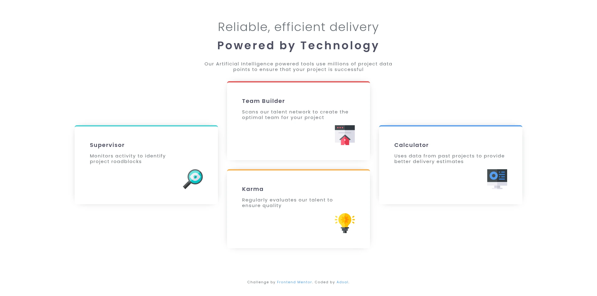

# Frontend Mentor - Four card feature section solution

This is a solution to the [Four card feature section challenge on Frontend Mentor](https://www.frontendmentor.io/challenges/four-card-feature-section-weK1eFYK). Frontend Mentor challenges help you improve your coding skills by building realistic projects. 

## Table of contents

- [Overview](#overview)
  - [The challenge](#the-challenge)
  - [Screenshot](#screenshot)
  - [Links](#links)
- [My process](#my-process)
  - [Built with](#built-with)
  - [What I learned](#what-i-learned)
  - [Continued development](#continued-development)
  - [Useful resources](#useful-resources)
  - [AI Collaboration](#ai-collaboration)
- [Author](#author)

## Overview

### The challenge

Users should be able to:

- View the optimal layout for the site depending on their device's screen size

### Screenshot




### Links

- Solution URL: [source code on github](https://github.com/a-adsal/feature-cards)
- Live Site URL: [live view](https://a-adsal.github.io/feature-cards)

## My process

- Organizing the files and assets.
- Building the HTML structure.
- Building a simple CSS framework from the reference design and the style guide.
- Tackling the page as simple tasks from top to bottom.
- Rework the CSS file to avoid repetitions as much as possible and clean up the code.

### Built with

- Semantic HTML5 markup
- Flexbox
- CSS Grid
- Mobile-first workflow


### What I learned

- Much better understanding of CSS Grid and the media property.

```css
.feature__cards {
  display: grid;
  gap: var(--gap-m);
  grid-template-columns: minmax(0, 1fr);
  @media (width > 44rem) {
    grid-template-columns: repeat(2, minmax(0, 1fr));
  }
  @media (width > 66rem) {
    grid-template-columns: repeat(3, minmax(0, 1fr));
    align-items: center;
    & > :last-child {
      grid-column-start: 2;
    }
    & > :first-child,
    & > :nth-child(3) {
      align-content: center;
      grid-row: span 2;
    }
  }
}
.card__wrapper {
  display: flex;
  flex-direction: column;
  gap: var(--gap-s);
  background-color: var(--clr-white);
  padding: calc(var(--gap-m) * 1.7);
  box-shadow: 0 0 1.7em -1em var(--clr-grey-400);
  border-top: 0.3em solid;
  border-radius: var(--radius-m);
  img {
    max-inline-size: clamp(3rem, calc(1.5023vw + 2.6479rem), 4rem);
    align-self: end;
  }
  @media (width > 66rem) {
    max-inline-size: fit-content;
  }
}

```
### Continued development

I need to work more on the mobile-first approach and on CSS Grid.


### Useful resources

- [CSS Grid Course - The Only Grid Tutorial You'll Ever Need! - made by: Coding2GO](https://youtu.be/JYfiaSKeYhE) - This video explained to me the most important parts of CSS Grid in under 30 minutes.

### AI Collaboration

Google AI for basic Q&A about why and when I should use logical properties and physical properties.

## Author

- github - [Adsal](https://github.com/a-adsal)
- Frontend Mentor - [@a-adsal](https://www.frontendmentor.io/profile/a-adsal)
- I don't have social media and never will :)


